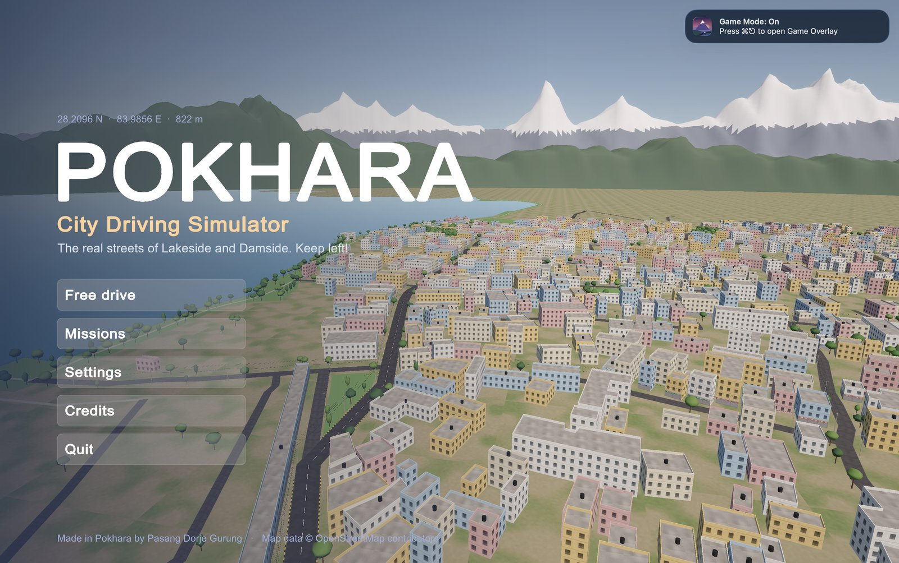
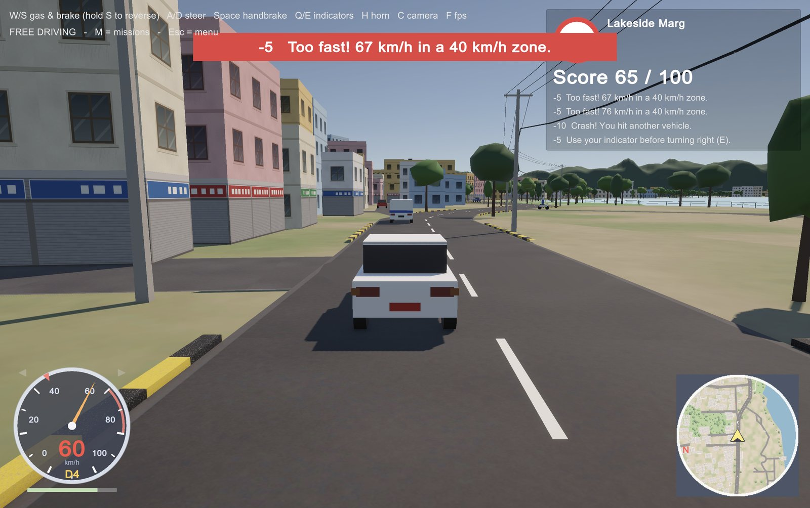
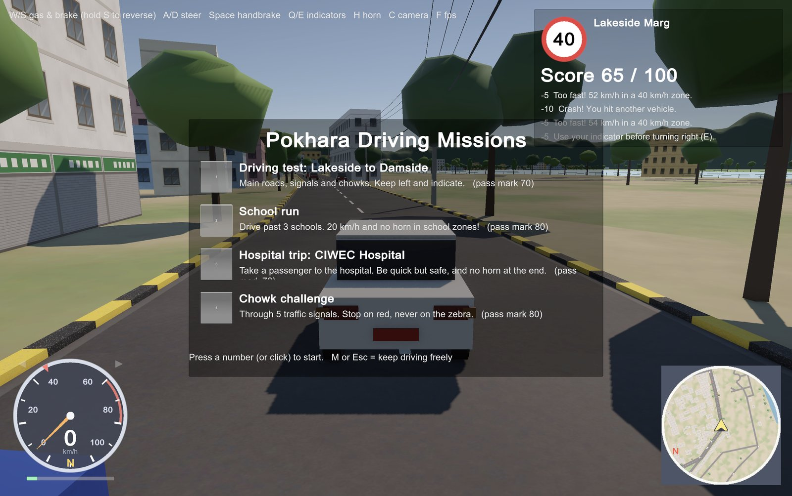
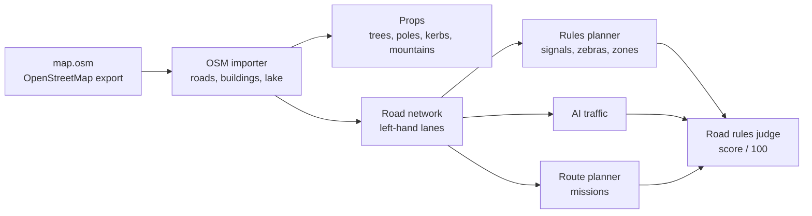

<p align="center">
  
</p>

<h1 align="center">Pokhara City Driving Simulator</h1>

<p align="center">
  Drive the <b>real streets of Lakeside and Damside, Pokhara</b>, built from OpenStreetMap data.<br>
  Nepali road rules, AI traffic, scored driving missions, and Machhapuchhre in the sky.
</p>

<p align="center">
  
  
  
  
</p>

---

## Screenshots

| Free drive on Lakeside Marg | Driving missions |
|---|---|
|  |  |

## Features

- **The real city:** 465 roads, 4,800+ buildings, Phewa Lake, parks and trees, all generated from an OpenStreetMap export by Unity editor tools I wrote (no hand modelling).
- **Pokhara feel:** Machhapuchhre and the Annapurna range placed in their real compass directions, prayer flags, black-and-yellow kerbs, electric poles with sagging wires, street ambience with birds, distant horns and temple bells.
- **Nepali road rules:** keep left, speed limits per road, indicators at junctions, traffic signals, zebra crossings with pedestrians, school zones (20 km/h) and silent hospital zones. A judge scores you out of 100.
- **AI traffic:** cars, taxis, Hiace microbuses, local buses, Tata trucks and motorbikes. They drive on the left, plan their route along the lanes, stop at red lights and zebra crossings, and honk if you block them.
- **Missions:** a driving test from Lakeside to Damside, a school run, a hospital trip, a chowk challenge. Each has a route planner (Dijkstra) that respects one-way roads, turn-by-turn directions, checkpoints, a timer and PASS / FAIL.
- **Polish:** title screen with a camera flight, pause and settings menus, a rotating minimap, analog speedometer, a 5-speed engine sound, and an FPS counter.

## Controls

| Key | Action | Key | Action |
|---|---|---|---|
| W / S | Gas / brake (hold S to reverse) | M | Missions |
| A / D | Steer | R | Retry mission |
| Space | Handbrake | Esc / P | Pause menu |
| Q / E | Left / right indicator | - / = | Minimap zoom |
| H | Horn | F | FPS counter |
| C | Chase / driver camera | F12 | Screenshot |

## How it works



Everything is generated by editor tools under **Tools > Pokhara City**, so a different OpenStreetMap export can become a different city.

## Build it yourself

1. Open the project in **Unity 6.3 LTS** (URP).
2. Export an area from [openstreetmap.org](https://www.openstreetmap.org/export) as `map.osm`.
3. Run, in order, from **Tools > Pokhara City**: Import OSM Map, Create Player Car, Add Props, Add Road Rules, Add Traffic, Add Missions, Add Menus and Minimap.
4. **Tools > Pokhara City > Check Project**, then **Build Mac App**.

## Project structure

```
Assets/PokharaCityImporter/PokharaCity/
  Editor/    importer, props, rules planner, traffic, mission and release tools
  Scripts/   Car, Rules, Traffic, Missions, UI, Props, Release
  Textures/  facades, shops, asphalt, kerbs, signs, icon (all generated)
```

## Credits

- **Map data © [OpenStreetMap contributors](https://www.openstreetmap.org/copyright)**, available under the Open Database Licence (ODbL).
- Designed and built by **Pasang Dorje Gurung**, a personal project. [LinkedIn](https://www.linkedin.com/in/pasang-dorje-gurung-222213280)
- Built with Unity 6 and C#. All sounds and textures are generated in code.
